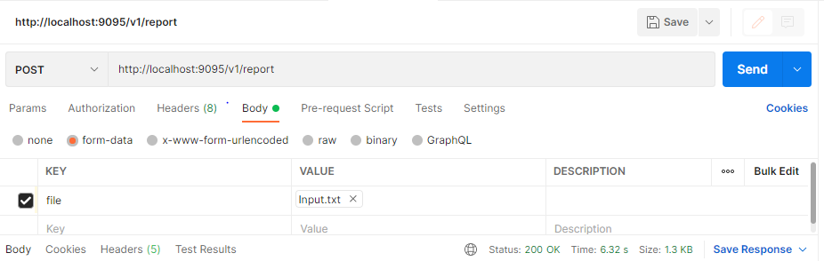
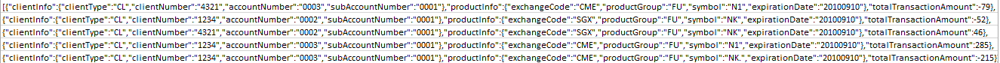
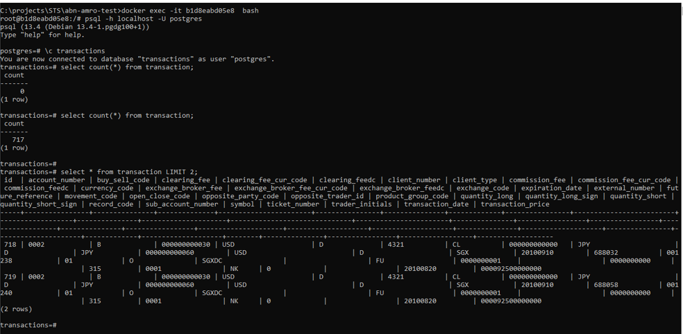

# ABN AMRO Technical Test

Kafka Technical Test for Abn-Amro

####Prerequisites:  

	1. Git (https://git-scm.com/downloads)
	2. Docker (https://docs.docker.com/get-docker/)
	3. Application can be run without docker as well. However, in that case Java and Maven need to be installed with Kafka and PostgresDB running. 
	4. Postman (https://www.postman.com/downloads/) - To test the API
	  
####Commands to run the project

1. Generate the Spring boot application jar and build a docker image   

	mvn install -DskipTests && docker build -t abn-amro-test.jar .
	
2. Bring up the all containers   

	docker-compose up -d 
	
The above commands will build and run the application. It will take a while (~5 mins) to download the images and start all containers. 

Once the application is up and running, launch Postman and send a Post request to the URL http://localhost:9095/v1/report by passing the file (Input.txt). Screenshot given below:

   

The Output will be displayed as below:  

   

PostgreSQL DB snapshot:

   

####NOTE:

1. All transactions will be recorded in the PostgreSQL Database. 
2. All transactions before parsing will be sent to the Kafka producer. These messages will be consumed by the Kafka consumer and stores it in the PostgreSQL database. 
 

####Assumptions:
1. The structures of the Input.txt doesn't change as the parsing logic depends on that. 

 